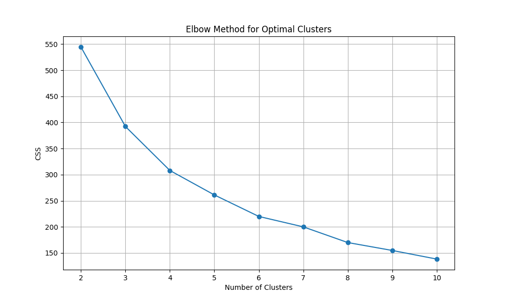
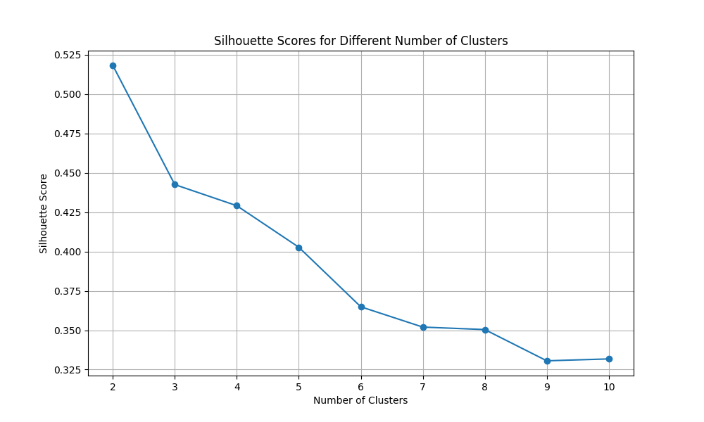
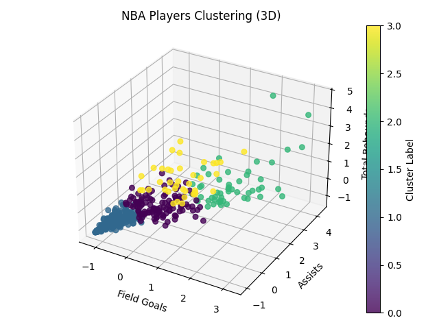

# 🏀 NBA Player Selection for the Washington Wizards (2023–2024)

This project applies unsupervised machine learning (K-Means clustering) to analyze and recommend high-value NBA players for the Washington Wizards based on performance metrics and salary constraints.

## 📌 Summary

Using the 2023–2024 NBA Player Dataset, I identified **Tyus Jones**, **Jalen Williams**, and **Josh Giddey** as ideal candidates for the Wizards. These players were selected based on a combination of:

- **Total Field Points**
- **Assists**
- **Rebounds**
- **Salary efficiency**

The goal was to recommend players who are both **performance-efficient** and **cost-effective**.

---

## 🧠 Methodology

### 🌀 Clustering Approach

- **Algorithm Used**: K-Means Clustering (Unsupervised Learning)
- **Purpose**: Group players by performance metrics to identify similar profiles
- **Features Used**: Points, Assists, Rebounds

### 📈 Optimal Clusters

- **Elbow Method**: Used to determine the optimal number of clusters by plotting the sum of squared distances.
  
  

- **Silhouette Score**: Evaluated cluster quality. Chose **4 clusters** based on a silhouette score of **0.43**, indicating moderately good separation.

  

---

## 📊 Cluster Insights

- **Cluster A**: Lower performance metrics
- **Cluster B**: Average players
- **Cluster C**: High assist players (collaborative)
- **Cluster D**: High rebound players (individually strong)

The visual plot below shows how players are distributed:

---

## 🔍 Player Evaluation Criteria

- Higher weight given to **Assists** (teamwork indicator)
- Secondary weight on **Total Field Points**
- Consideration of **Rebounds** for overall performance balance
- Efficiency Metric:  
  `value = (standardized_points + assists + rebounds) / salary`

---

## 🏅 Final Player Recommendations

1. **Tyus Jones**
2. **Jalen Williams**
3. **Josh Giddey**

All three players:
- Belong to the assist-focused cluster
- Are priced between **$2M–$5M**
- Offer **strong overall stats relative to cost**
- Are currently **undervalued** and present **high potential ROI**

---

## 💬 Conclusion

These players offer the best combination of collaboration, scoring ability, and salary efficiency. Their selection could significantly enhance the Wizards' performance this season.
